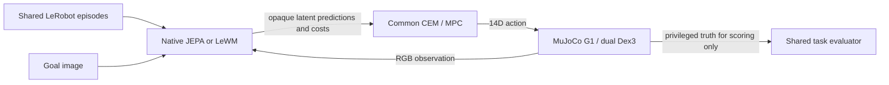

# Open Embodied JEPA

One robot stack. One benchmark. Many world models.

A Mac-first research framework for action-conditioned visual world models on a simulated Unitree G1 with dual Dex3 hands. Native JEPA and the pinned upstream LeWM implementation share canonical LeRobot data, an image-goal CEM/MPC planner, robot actions and evaluation.

**Implemented:** real MuJoCo collection/control, both trainable model adapters, strict checkpoints, CPU/MPS checks, a frozen benchmark runner, and mock-only SDK2 preparation. All six training runs and 400 frozen benchmark attempts are complete. **Learned Apple→Plate remains unsuccessful: 0/150 for each model.** The [acceptance audit](docs/ACCEPTANCE.md) separates implemented software from demonstrated research outcomes. Isaac and physical robot execution are future work.

The [completed feasibility follow-up](docs/experiments/feasibility_results_v2.md)
finished 20/20 matched attempts after a roughly 2.1× projection speedup, with
1,000/1,000 projected actions accepted. It still produced no learned pick-and-place.

Task-specific apple work now adds a learned RGB/proprioceptive `sensor_wm`,
TRAIN-image waypoint planning, 31/32 successful scripted collection episodes, and
528 audited matched action branches. The first learned-control diagnostic was
**0/6 placements**. Balanced H16 training now passes the
[primary causal-prediction gate](docs/experiments/apple_branch_h16_diagnostics_results_v1.md)
with 89.40% action assignment and 81.41% endpoint error reduction. Physical control
still fails: the resumed development comparison completed one learned run with
reach but no grasp, timed out one persistence control, and left four attempts
unstarted under its fixed budget. A [saved-state forecast audit](docs/experiments/apple_control_forecast_results_v1.md)
reproduced the stalled trace and found useful progress from complete chosen plans
at two states. The subsequent [four-command comparison](docs/experiments/apple_control_commitment_results_v1.md)
started all six attempts but reached no physical stage (two completed learned
failures and four timed-out controls).
Prediction accuracy and short-branch progress do not establish manipulation success.
The fresh 20-reset final cohort remains unexecuted. This is a separate task-specific
mode; the historical unseen-pair benchmark above is unchanged. The optional
[JEPA-WMs adapter](docs/experiments/jepa_wms_spike.md) has CPU software compatibility
coverage and no manipulation-performance claim.

Development reaching models passed the declared per-dimension collapse and action-sensitivity checks, with each achieving 1/5 successes versus hold/random 0/5. An earlier-release scripted controller achieved 4/4 full pick-and-place successes on seen pairings. Scripted successes are not learned-policy results. Failures and diagnostic corrections remain in the [research reports](docs/experiments/reach_results.md).

## Run a small end-to-end example

On a Mac with Python 3.12 and `uv`, from this repository:

```sh
uv sync --locked --extra learning --extra sim --extra lewm --extra data --extra compatibility
uv run --no-sync python scripts/fetch_assets.py
uv run --no-sync python scripts/fetch_lewm.py
uv run --no-sync python scripts/fetch_lerobot.py
uv run --no-sync python scripts/reproduce_smoke.py
```

This collects 12 short real-simulation episodes, trains both models for 100 updates, reloads their checkpoints, and runs a two-reset image-goal smoke benchmark with a backend-only YAML override. It validates the integration; the tiny training budget does not establish useful manipulation. Outputs stay under ignored `data/`, `checkpoints/`, and `outputs/clean-smoke/`. Existing outputs are protected; use `--name another-smoke` for a separate run.

For checks and optional graphics:

```sh
uv run --no-sync ruff check src tests scripts
uv run --no-sync ruff format --check src tests scripts
JEPA_TEST_RENDER=1 LEROBOT_SOURCE=third_party/lerobot uv run --no-sync pytest
```

Core CI runs on Linux and macOS. A separate macOS integration job executes actual model, data-reader and physics checks; hosted graphics/MPS availability skips are explicit. No CUDA, Isaac or robot connection is required.

## How the pieces fit



Models own visual features, latent dynamics and goal distance. The embodiment owns frames, IK, hand synergies and limits. Planner code has no model-specific branches. Both models train on the same sealed dataset, and frozen image goals/reset manifests keep evaluation consistent.

The final local corpus has **184 episodes and 42,127 transitions**, with preserved **146/19/19** train/validation/test assignments. Apple→Plate is reserved as an unseen pairing; its component appearances are seen separately. Large datasets and checkpoints remain local; versioned manifests, protocols and summaries provide their hashes and reproduction commands.

## Documentation

- [Setup](docs/SETUP.md), [models](docs/MODELS.md), [training](docs/TRAINING.md), [data format](docs/DATA_FORMAT.md), [simulation](docs/SIMULATION.md).
- [Measured MVP results](docs/experiments/mvp_results.md), [final training protocol](docs/experiments/mvp_final.md), [frozen evaluation protocol](docs/experiments/mvp_evaluation.md), [evaluation semantics](docs/EVALUATION.md).
- [Original PRD](PRD.md), [MVP plan](docs/MVP_PLAN.md), [architecture](docs/ARCHITECTURE.md), [decisions](docs/DECISIONS.md).
- [SDK2 hardware preparation](docs/HARDWARE.md), [Isaac port](docs/ISAAC_PORT.md), [Mac resources](docs/RESOURCES.md), [dependency provenance](docs/DEPENDENCIES.md).
- [Contributing](CONTRIBUTING.md), [AGENTS.md](AGENTS.md), and [Codex project skills](docs/SKILLS.md) define the commit → PR → review → merge workflow.

The executable package is in `src/embodied_jepa/`, tests in `tests/`, and reproducible commands in `scripts/`. Top-level model, robot, planner, data and deployment directories document their architecture responsibilities.

## Task tracking

MissionControl task Markdown in `.mc/` is the source of truth for acceptance and follow-up work:

```sh
mc task board
mc task next
mc show TASK-023
mc validate
mc index
```

Original contributions use [Apache-2.0](LICENSE). Fetched upstream source, robot assets and dependencies retain their own terms; see the [inventory](docs/DEPENDENCIES.md). No upstream pretrained weights are required.
