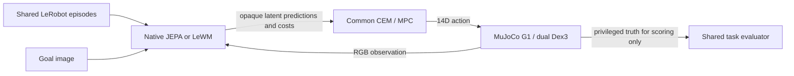

# Open Embodied JEPA

One robot stack. One benchmark. Many world models.

A Mac-first research framework for action-conditioned visual world models on a simulated Unitree G1 with dual Dex3 hands. Native JEPA and the pinned upstream LeWM implementation share canonical LeRobot data, robot actions, one planner implementation and one evaluator.

## Status — 2026-09-24

**Learned Apple→Plate has never succeeded: 0 successes.** The frozen unseen-pair
benchmark recorded 0/50 on each of three training seeds for both backends — **0/150 per
model**, 400 attempts including hold and random controls — and every task-specific apple
control attempt since has failed its own declared gate. Scripted-collector and
privileged-oracle successes are collection and feasibility evidence, not learned-policy
results. Green CI and a passing integration smoke run are software evidence, not working
manipulation.

**The control line has changed.** The [world model v4 results](docs/experiments/apple_world_model_v4_results.md)
(TASK-054) failed all four arms against 14 preregistered gates and fired the protocol's
pre-declared abandonment clause: **sampling-based planning (CEM/MPC) over this
world-model cost is abandoned as the primary control line**, and behaviour cloning with
the world model as a critic becomes the primary line. The CEM/MPC implementation, the
frozen benchmark and the backend-swap invariant stay in the repository, keep their tests
and remain usable. The product goal — LeWM on G1 + dual Dex3 — is unchanged; only the
control formulation changed. The decision and its evidence are recorded in
[docs/DECISIONS.md](docs/DECISIONS.md).

**What is demonstrated.** These are software properties and offline properties of
checkpoints on recorded validation data — none of them is a manipulation result.

- **The backend-swap invariant.** `configs/mvp_lewm.yaml` is `extends: mvp_common.yaml`
  plus `world_model.backend`; both backends run the same data, actions, planner, task and
  evaluator, and the swap is exercised by tests and by the reproduction smoke.
- **Infrastructure:** a real MuJoCo G1 + dual-Dex3 runtime, LeRobot-v3-compatible storage
  with verified hashes, two trainable model adapters, checkpoints that enforce their
  provenance, frozen goal/reset manifests, a validated result schema, and mock-only SDK2
  preparation. Isaac and physical robot execution remain future work.
- **The encoder is the component that works.** A directly encoded observation reads the
  palm–apple offset to **2.35–2.59 cm** median on held-out validation windows (start to
  target, on the three v4 arms whose encoder was intact), against 3.13 cm at v2. It is not
  sufficient: 2.59 cm alone exceeds the 1.5 cm gate.
- **`apple_held` AUROC 0.9992–0.9997** on the lift cohort. Read it with its control — the
  shuffled-action AUROC on the same cohort is 0.714–0.812, so most of that signal comes
  from the encoded state and fused proprioception, not from action-conditioned prediction.
- **No representation collapse:** effective rank 6.74–8.23, collapsed fraction 0.000,
  mean latent std 0.850–0.873 on all four v4 arms.

**What has been ruled out, with evidence.**

- **Five specific attempts to fix the prediction step under motion.** That step has never
  beaten the model's own persistence readout by the required margin (gate G2a ≤ 0.8; best
  ever recorded **0.831**, at v3, against 0.8635 at best in v4 and 0.835 at v2), and these
  five did not change it: a second camera (made readout precision worse), motion-weighted
  readout shaping (no help, and it hurt candidate ranking), action-chunk conditioning (no
  effect), a tail-weighted multistep loss (about 15% of the needed change, and not
  distinguishable from cohort sampling), and a non-shared per-step predictor (damaged the
  encoder). In v4 the **untouched control passed more gates (10 of 14) than every
  intervention (9 of 14)**. This does not establish that the prediction step cannot be
  fixed — it is three designs at one seed and one budget in v4, and two more in v3.
- **The cost-and-phase design as the explanation for the physical failures.** Under exact
  MuJoCo dynamics and perfect object state the
  [v3 grasp-closure ceiling](docs/experiments/apple_wide_grasp_closure_results_v3.md)
  reached 8/8 full successes on fresh wide-jitter resets (`ceiling_adequate`), after the
  [v2 ceiling](docs/experiments/apple_wide_object_ceiling_results_v2.md) failed at 5/8.
  That is a non-learned diagnostic: it says the design is adequate as a target for a
  learned controller, and it moves attention to the learned rollout. It does not prove
  that nothing else in the loop is also wrong.

**The one learned closed-loop result that ever beat its controls**, kept here so the
summary is complete in both directions: the corrected v2 development *reaching* models
each reached **1/5** fixed development goals against 0/5 for hold and random
([reach_results.md](docs/experiments/reach_results.md)). The 95% Wilson interval for 1/5,
[0.036, 0.624], overlaps the controls' [0, 0.434], so this is observed progress on an
intermediate milestone, not established superiority and not the full task.

**Open, not decided.** Whether the prediction step can be fixed at all: v4 tested three
specific designs at one seed and one budget. The test split has still never been decoded,
so one unbiased check remains available. The fresh 20-reset final apple cohort
(TASK-034) remains unexecuted.

Detail lives in the per-experiment record under [docs/experiments/](docs/experiments/)
and the manifests under [benchmarks/manifests/](benchmarks/manifests/). Those files are
the frozen historical record, including refuted hypotheses, and are not rewritten. The
[acceptance audit](docs/ACCEPTANCE.md) is the 2026-09-20 snapshot separating implemented
software from demonstrated research outcomes. The optional
[JEPA-WMs adapter](docs/experiments/jepa_wms_spike.md) has CPU software compatibility
coverage and no manipulation-performance claim.

## Run a small end-to-end example

On a Mac with Python 3.12 and `uv`, from this repository:

```sh
uv sync --locked --extra learning --extra sim --extra lewm --extra data --extra compatibility
uv run --no-sync python scripts/fetch_assets.py
uv run --no-sync python scripts/fetch_lewm.py
uv run --no-sync python scripts/fetch_lerobot.py
uv run --no-sync python scripts/reproduce_smoke.py
```

This collects 12 short real-simulation episodes, trains both models for 100 updates, reloads their checkpoints, and runs a two-reset image-goal smoke benchmark with a backend-only YAML override. It validates the integration; the tiny training budget does not establish useful manipulation. Outputs stay under ignored `data/`, `checkpoints/`, and `outputs/clean-smoke/`. Existing outputs are protected; use `--name another-smoke` for a separate run.

For checks and optional graphics:

```sh
uv run --no-sync ruff check src tests scripts
uv run --no-sync ruff format --check src tests scripts
JEPA_TEST_RENDER=1 LEROBOT_SOURCE=third_party/lerobot uv run --no-sync pytest
```

Core CI runs on Linux and macOS. A separate macOS integration job executes actual model, data-reader and physics checks; hosted graphics/MPS availability skips are explicit. No CUDA, Isaac or robot connection is required.

## How the pieces fit



Models own visual features, latent dynamics and goal distance. The embodiment owns frames, IK, hand synergies and limits. Planner code has no model-specific branches. Both models train on the same sealed dataset, and frozen image goals/reset manifests keep evaluation consistent.

The CEM/MPC planner above is the implemented common planner and the one the historical
benchmark ran. As of TASK-054 it is **no longer the primary control line** (see the status
section); it remains in the repository, under test, as the shared planner contract.

The MVP corpus has **184 episodes and 42,127 transitions**, with preserved **146/19/19**
train/validation/test assignments; Apple→Plate is reserved there as an unseen pairing and
its component appearances are seen separately. The later task-specific apple corpus
(`data/apple-wide-v1`, [manifest](benchmarks/manifests/apple-wide-collection-v1.json)) adds
797 episodes and 205,519 transitions of privileged scripted collection with injected
perturbations. Large datasets and checkpoints remain local; versioned manifests, protocols
and summaries provide their hashes and reproduction commands.

## Documentation

- [Setup](docs/SETUP.md), [models](docs/MODELS.md), [training](docs/TRAINING.md), [data format](docs/DATA_FORMAT.md), [simulation](docs/SIMULATION.md).
- [Measured MVP results](docs/experiments/mvp_results.md), [final training protocol](docs/experiments/mvp_final.md), [frozen evaluation protocol](docs/experiments/mvp_evaluation.md), [evaluation semantics](docs/EVALUATION.md).
- Latest experimental record: [world model v4 results](docs/experiments/apple_world_model_v4_results.md) (the abandonment of CEM over this cost), [v3 results](docs/experiments/apple_world_model_v3_results.md), [v2 results](docs/experiments/apple_world_model_v2_results.md).
- [Original PRD](PRD.md), [MVP plan](docs/MVP_PLAN.md), [architecture](docs/ARCHITECTURE.md), [decisions](docs/DECISIONS.md).
- [SDK2 hardware preparation](docs/HARDWARE.md), [Isaac port](docs/ISAAC_PORT.md), [Mac resources](docs/RESOURCES.md), [dependency provenance](docs/DEPENDENCIES.md).
- [Contributing](CONTRIBUTING.md), [AGENTS.md](AGENTS.md), and [Codex project skills](docs/SKILLS.md) define the commit → PR → review → merge workflow.

The executable package is in `src/embodied_jepa/`, tests in `tests/`, and reproducible commands in `scripts/`. Top-level model, robot, planner, data and deployment directories document their architecture responsibilities.

## Task tracking

MissionControl task Markdown in `.mc/` is the source of truth for acceptance and follow-up work:

```sh
mc task board
mc task next
mc show TASK-023
mc validate
mc index
```

Original contributions use [Apache-2.0](LICENSE). Fetched upstream source, robot assets and dependencies retain their own terms; see the [inventory](docs/DEPENDENCIES.md). No upstream pretrained weights are required.
