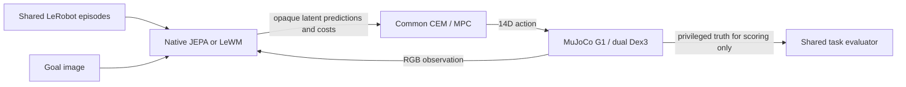

# Open Embodied JEPA

One robot stack. One benchmark. Many world models.

A research framework for action-conditioned visual world models on a simulated Unitree G1 with dual Dex3 hands (working platform: Linux with CUDA since TASK-072; macOS supported). Native JEPA and the pinned upstream LeWM implementation share canonical LeRobot data, robot actions, one planner implementation and one evaluator.

## Status — 2026-10-08

**Learned Apple→Plate on the frozen v1 MVP benchmark (TASK-020) is 0/150 per backend (`native_jepa` and LeWM). On `apple-to-plate-v2`, the behaviour-cloning/DAgger policy P-3 (an MLP on a frozen DINOv2 readout, trained on demonstrations from the privileged scripted expert e9; not a world model) scored 40/40 counted successes on the held-out cohort C against 39/40 for its random-init encoder control R-3 (one run, one training seed per arm, 40 resets, one camera at 112 px onboard, a narrow reset distribution), so TASK-072 M2 is M2-FAIL on G3 (encoder pretraining contributed nothing measurable), and cohort C is no longer held out. The first LeWM-driven closed loop on v2 whose counts are read is TASK-080's Stage D, a non-gating development cohort (one run, one model seed, 16 resets, in simulation only, under the declared simulation-only plate condition C1-M): a LeWM token predictor on frozen DINOv2 features chose the single place aim between P-3's learned pick and e9's scripted place and reached 16/16 counted successes, against 8/16 for its action-blind twin and 5/16 and 9/16 for its two scene-blind twins (the privileged look-ahead ceiling also 16/16). That is a development result, not a gated one: TASK-080's gated Stage S has not run, LeWM has no gated closed-loop Apple→Plate success, and its only other closed-loop Apple→Plate runs whose counts are read are on v1, with 0 successes. Scripted-expert, privileged-ceiling, oracle and GR00T successes are not project-learned results.** (This is the canonical status sentence; see [decision 2026-10-02, R7](docs/DECISIONS.md), as updated on 2026-10-08 by R18.28, for its scope.)

On v1, the frozen unseen-pair
benchmark recorded 0/50 on each of three training seeds for both backends — **0/150 per
model**, 400 attempts including hold and random controls. The same 50 resets were reused
across seeds, and every learned episode ended on a joint-rate guard stop, typically within
a few commands (per-run medians 3–15, maximum 170). Every *learned* task-specific apple control attempt since, through TASK-057, has ended
without meeting its own declared gate (failed it, stopped at an earlier offline gate or stop
rule, or ran incomplete). Scripted-collector and
privileged-oracle successes are collection and feasibility evidence, not learned-policy
results. Green CI and a passing integration smoke run are software evidence, not working
manipulation.

**The control line has changed.** The [world model v4 results](docs/experiments/apple_world_model_v4_results.md)
(TASK-054) failed all four arms against 14 preregistered gates and fired the protocol's
pre-declared abandonment clause: **sampling-based planning (CEM/MPC) over this
world-model cost is abandoned as the primary control line**, and behaviour cloning with
the world model as a critic became the primary line; that line has since hit its own
abandonment clause too (below), so there is currently no primary control line. The CEM/MPC implementation, the
frozen benchmark and the backend-swap invariant stay in the repository, keep their tests
and remain usable. The product goal — LeWM on G1 + dual Dex3 — is unchanged; only the
control formulation changed. The decision and its evidence are recorded in
[docs/DECISIONS.md](docs/DECISIONS.md).

**The behaviour-cloning line has also hit its abandonment clause (TASK-057, 2026-09-25).**
The preregistered [policy diagnostics](docs/experiments/apple_policy_diagnostics_v1_results.md)
ran with every control passing. The run used the non-gating development cohort, with n = 16 resets
per configuration and deterministic simulation.

- **Observation:** the controller's observation matches the training observation.
- **No single channel rescues the policy.** Substituting any one command channel from the
  privileged scripted expert (a diagnostic, not a learned result) got at most 1/16 resets to grasp,
  against thresholds of 8–12. The clause therefore fired.
- **Consequence:** no third control formulation is preregistered on this corpus and this camera.
  The next task is a perception/data task, chosen by the task owner.
- **Where the arms fail:** mostly at the approach. After an early rise that matches the expert's
  own first phase, most attempts never descend toward the apple.
- **The two grasps:** on the two attempts that grasped, the hand held the apple on every step
  afterwards and never carried it to the plate.

At that point learned Apple→Plate was still 0 successes.

**Since TASK-057 (as of 2026-09-27).** The research tasks since are offline perception, data
and world-model tests, not controllers: readability probes (TASK-059, TASK-061–TASK-063; at
TASK-062 a clause closed the in-corpus encoder-training line), the `apple-look-v1` corpus
(TASK-064), and a LeWM-style predictor on frozen DINOv2 CLS latents (TASK-065, outcome
WM-NO-DYNAMICS; its clause closed only the pooled-CLS predictor line). TASK-066, the same kind
of test over frozen DINOv2 patch-token latents pooled to a 4 × 4 grid
([results](docs/experiments/apple_token_dynamics_v1_results.md)), ended with outcome
**WM-TOK-DYNAMICS**: every seed passes the preregistered gates at h = 8 and h = 16, on 170
cross-fitted train sessions of this one corpus, with a static apple. This is a world-model
dynamics result on the train split only, and it makes no control claim. Four caveats: the
training budget did not saturate, which may favour W on G3 and G1 (iii); G2 at h = 8 and G5 for
seed 2 at h = 8 pass by narrow margins; the token latent's rank ratio is not better than
TASK-065's CLS ratio; and the claim is train-split only. TASK-067, an apple-first
learned-policy control formulation
([results](docs/experiments/apple_first_policy_v1_results.md)), ended with outcome
**CAL-ESCALATE**: its gated run stopped at the C0 calibration, before any policy was trained or
evaluated, because the privileged scripted expert's tolerance to plate error fell to 21/32 at
the smallest preregistered plate level (1.0 cm), below the 28/32 bar, so no feasible plate bar
exists. The abandonment clause does not fire. The owner-ruled diagnostic probe of the
collector's release point ([release probe](docs/experiments/apple_first_policy_v1_release_probe.md))
ended **P-CANDIDATE-FAIL**: a collector releasing over the plate centre reached 23/32 at 1.0 cm
plate error, below 28/32. The results document's "releases 3.5 cm short" explanation is
contradicted by the probe's per-attempt landings (its declared rule counted the mechanism as
confirmed): the probe's failures land forward or sideways, near the plate rim (inferred; no
contact recorded), not short. The owner-ruled diagnosis of the current collector ([landing
diagnosis](docs/experiments/apple_first_policy_v1_landing_diagnosis.md)) then identified the
mechanism from its logs: the collector drops the apple about 15.5 cm, the apple rolls to the
plate rim and ends outside the scorer's 4 cm radius on most resets (4/32 at rest with the plate
exact), and the success scorer's latched stages count transient 0.15 s crossings of the disc. The one
owner-allowed redesign, placing the apple at the plate centre before opening, failed (25/32 with the
plate exact, 20/32 at 1.0 cm, below 28/32) with its premise untested, because the hand did not
reach the place pose within its budget. TASK-067 is closed under the owner's fallback.
Scripted-collector and privileged success numbers elsewhere that were scored with this latching
scorer are flagged, not rewritten.
TASK-068 ([docs/experiments/apple_resting_expert_v1.md](docs/experiments/apple_resting_expert_v1.md)) closed on its development finding, with no gated run: under the frozen v1 task no privileged scripted expert design tried rested the apple on the plate (0 at rest in 269 completed development attempts), because the place pose is beyond the fixed-pelvis arm's reach and the apple, a sphere with no rolling resistance in this scene, keeps rolling; TASK-069, a development-only feasibility scan, led to the owner-defined `apple-to-plate-v2` task (`src/embodied_jepa/apple_to_plate_v2.py`): v1 plus the apple's contact at condim 6 with the scene's own declared friction, a benchmark separate from v1. TASK-070 ([docs/experiments/apple_to_plate_v2_expert.md](docs/experiments/apple_to_plate_v2_expert.md)) passed its preregistered gate on v2: the privileged scripted expert e9, selected on development seeds, left the apple at rest (`apple_at_rest_v0`) on 32/32 fresh gated seeds with the plate exact and 30/32 at 1.0 cm plate error (bar 28/32). That is a scripted-expert result, not a learned one; v1 and its 0/150 benchmark are unchanged. TASK-071 ([docs/experiments/apple_first_policy_v2_results.md](docs/experiments/apple_first_policy_v2_results.md)) ended M1-PASS: on the non-gating development cohort of apple-to-plate-v2, a behaviour-cloning/DAgger policy on a frozen DINOv2 readout, trained on e9's demonstrations, reached counted successes (at rest after a latched grasp and place) on 16/16 resets for the carried arm P-3 (P-0 4, P-1 9, P-2 15). That is an existence result only, a learned policy with a DINOv2 encoder, not LeWM; the random-init encoder floor R-3 also reached 16/16, so encoder pretraining shows no measurable contribution there, and the no-image control reached 3/16. The official learned Apple→Plate count on the frozen benchmark stayed 0, and cohort C was untouched until M2 (below). TASK-072 ([docs/experiments/apple_first_policy_v2_linux_results.md](docs/experiments/apple_first_policy_v2_linux_results.md)) re-ran that whole pipeline on the Linux PC (strict-deterministic CUDA training, NVIDIA EGL rendering) and ended REPLICATED: M1-PASS, with P-3 at 16/16 on the same 16 development resets as the Mac run. R-3 again tied it at 16/16, so there is still no evidence that pretrained vision helps, and the no-image control reached 7/16. This replicates the development-cohort existence result only; it is not LeWM, and learned Apple→Plate on the frozen benchmark is still 0. M2, the held-out test on cohort C ([docs/experiments/apple_first_policy_v2_m2_results.md](docs/experiments/apple_first_policy_v2_m2_results.md)), ended **M2-FAIL on G3 alone**: P-3 reached 40/40 counted successes and beat the no-image control (12/40) and open-loop replay (28/40), but the random-init encoder floor reached 39/40. The claim is not made by the rule. By owner ruling (2026-09-28), M2-FAIL stays the recorded row, and G3's declared reading is adopted as the interpretation: on held-out apple-to-plate-v2 resets, a learned visuomotor policy (DINOv2 + BC/DAgger, trained on e9 demonstrations) works, and encoder pretraining contributes nothing measurable. This is one run, one training seed per arm, one camera (112 px onboard), a narrow reset distribution and a corpus of privileged scripted-expert (e9) demonstrations. Cohort C has now been simulated and is no longer held out. It is not LeWM, and the v1 benchmark is still 0/150.

**Since M2 (as of 2026-10-02).** Three LeWM-oriented tasks on v2 followed; none ran LeWM in closed
loop.

- **TASK-073** ([results](docs/experiments/apple_wm_critic_v2_results.md)), a LeWM token critic
  to pick P-3's aim under a simulation-only mid-episode plate shift, ended at its K0 calibration
  (32 development resets per cell, one run) with row **S-NO-CONDITION**: where the shift broke
  the unaided policy, P-3 given the true plate already reached 26–29/32, and privileged
  look-ahead added at most +3/32 (bar +4), so there was no measurable room for a critic. The
  critic was never trained or run, and the clause did not fire.
- **TASK-074** ([results](docs/experiments/apple_lewm_planner_v2_results.md)), a LeWM token
  planner choosing where e9's place primitive puts the apple after a 9 cm plate move, closed
  **INCONCLUSIVE** without the clause after two budget escalations of its train stage. Its
  offline bar was unreachable anyway: the encoded readout's error (2.872 cm) sits above the
  uncalibrated 1.0 cm bar.
- **TASK-075** ([results](docs/experiments/apple_obs_ceiling_v2_results.md)), an
  observation-ceiling study, ended **OBS-NONE** and its clause fired: against τ = 1.0 cm, no view
  (onboard 112 and 224 px, the hand crop, overview 224 px) reads the apple-minus-plate offset with
  frozen DINOv2 features (upper bounds 2.66–3.44 cm), and no pooled-token readout beats a clock
  prior that reads no image. That closes a LeWM planner or critic for the place phase under
  TASK-074's condition on these views with frozen DINOv2 features, without new evidence of a
  different kind. Reported only: the plate is read to 0.49–0.68 cm in median (tails up to about 1.36 cm), the apple to 2.2–3.1 cm.
- **TASK-076** ([results](docs/experiments/apple_plate_twin_v2_results.md)), the plate-readout
  perception twin, ended **TWIN-PASS** with no world model in the loop: P-3's learned pick plus
  e9's scripted place aimed at a frozen-DINOv2 ridge readout of the plate scored 64/64 on gated
  resets under TASK-074's 9 cm condition, against 51/64 for an image-free clock prior and 64/64
  for the true plate. The random-init floor also scored 64/64, so pretraining is not shown to
  matter. Its prediction-headroom check is **PRED-INFEASIBLE** (its only action-dependent cell was
  removed at Stage 0), so no LeWM planner is admitted and the next LeWM task comes from PLAN.md's
  Branch B ([decision 2026-10-04](docs/DECISIONS.md), R13).
- **TASK-077** ([results](docs/experiments/apple_lewm_c1m_v2_results.md)), a LeWM token predictor
  on frozen DINOv2 tokens pooled to 8 × 8 that would choose the single place aim committed at
  step 405 under C1-M, stopped at its offline Stage G with **G-NO-BAR** (escalate, no clause):
  offline at h = 60 the roll-out is not collapsed, is action-sensitive and beats copy-last and a
  no-action model on all three seeds, but the plate readout on the predicted latent at the read
  step misses τ_commit = 1.0 cm on all three (1.58–1.87 cm in median, against 0.41 cm on the
  encoded frame). The closed loop did not run, so no LeWM-driven controller had then run in closed
  loop on v2 ([decision 2026-10-05 (b)](docs/DECISIONS.md), R17.50–R17.52).
- **TASK-080** ([protocol](docs/experiments/apple_lewm_c1m_v2_pred_readout.md), FROZEN) reuses
  TASK-077's models with a plate readout fitted on W's own predicted latents. It passed its
  offline gate on fresh roots (R-PASS; W's predicted count 56.92 of 64 against a bar of 56, a
  margin under one reset; a prediction, not a closed-loop count). Its **Stage D**, a non-gating
  development closed loop on 16 resets, ended **D-PASS**: W 16/16 counted successes, the
  action-blind twin N 8/16, the scene-blind twins 5/16 and 9/16, and the privileged look-ahead
  ceiling 16/16. LeWM chooses only the single place aim, between P-3's learned pick and e9's
  scripted place, under a plate law the simulator imposes (C1-M). It is one run, one model seed,
  16 resets, simulation only, and not the gated result: the rule-based comparators did not run in
  D, and the gated Stage S (64 resets, every arm) has not run
  ([decision 2026-10-08 (c)](docs/DECISIONS.md), R18.27–R18.29).
- **Development only, not gated:** an opt-in white plate leaves TASK-075 at OBS-NONE (any colour
  effect on the offset's median error is bounded to about 0.90–1.11; 1 of 12 intervals excludes 1.0)
  ([white plate](docs/experiments/apple_white_plate_dev.md)). In Isaac Lab-Arena (TASK-025,
  [ARENA.md](docs/ARENA.md)), e9 left the apple at rest on 0/16 development seeds (16/16 in
  MuJoCo), and NVIDIA's GN1x-Tuned release (GR00T N1.7, step 65000), not the tutorial's checkpoint-20000, run client-only as an external reference, scored 16/30 and
  10/30 under Arena's loose rule and 0/30 under our strict at-rest rule, whose check used PhysX's
  reported velocity (a post-hoc position check gives 6/30). Neither is a project-learned result.

Outcomes and caveats are in the [experiment index](docs/experiments/README.md), the results
documents under [docs/experiments/](docs/experiments/) and [AGENTS.md](AGENTS.md).

**What is demonstrated.** These are software properties and offline properties of
checkpoints on recorded validation data — none of the items in this list is a manipulation
result. (TASK-071/072's P-3, above, is a learned v2 manipulation result; it is not a world model.)

- **The backend-swap invariant.** `configs/mvp_lewm.yaml` is `extends: mvp_common.yaml`
  plus `world_model.backend`; both backends run the same data, actions, planner, task and
  evaluator, and the swap is exercised by tests and by the reproduction smoke.
- **Infrastructure:** a real MuJoCo G1 + dual-Dex3 runtime, LeRobot-v3-compatible storage
  with verified hashes, two trainable model adapters, checkpoints that enforce their
  provenance, frozen goal/reset manifests, a validated result schema, and mock-only SDK2
  preparation. Isaac (PhysX and Newton) and Isaac Lab-Arena exist as development cross-sim
  checks under TASK-025 (e9 replay, Arena e9 0/16, the GR00T reference baseline); they are not
  admitted as benchmarks. Physical robot execution remains future work (`hardware.py` is
  mock-only).
- **The encoder is the component that works.** A directly encoded observation reads the palm–apple
  offset to a median of **2.35–2.40 cm** on the start frame and **2.54–2.59 cm** on the target
  frame, on the three v4 arms whose encoder was intact. Four qualifiers apply:
  - the figure covers only the moving validation windows;
  - that validation split was also used for checkpoint selection;
  - the encoding includes fused proprioception;
  - the v2 comparison figure, 3.13 cm, was carried over at v4 without recomputation, and no
    artifact recorded it until TASK-058 reproduced it (3.1297 cm).

  It is not sufficient: 2.59 cm alone exceeds the 1.5 cm gate.
- **`apple_held` AUROC 0.9992–0.9997** on the lift cohort. This is weak evidence. Copying the
  true (simulator) start state forward already reaches AUROC 0.956, and the shuffled-action control
  (0.714–0.812) cannot say how much of the signal comes from the encoded state rather than
  from action-conditioned prediction.
- **No representation collapse:** effective rank 6.74–8.23, collapsed fraction 0.000,
  mean latent std 0.850–0.873 on all four v4 arms.

**What has been ruled out, with evidence.**

- **Five specific attempts to fix the prediction step under motion.** That step has never
  beaten the model's own persistence readout by the required margin (gate G2a ≤ 0.8; best
  ever recorded **0.831**, at v3, against 0.8635 at best in v4 and 0.835 at v2), and these
  five did not change it:
  - a second camera, which made readout precision worse;
  - v3's readout shaping, which bundled motion weighting with auxiliary position targets. It
    did not help, and G6a was lower on one seed;
  - action-chunk conditioning, which had no effect;
  - a tail-weighted multistep loss. It reduced the excess by 14.6 % where 49.9 % was needed,
    under a third of the required change, and was not distinguishable from cohort sampling;
  - a non-shared per-step predictor, which damaged the encoder.

  In v4 the untouched control passed 10 of 14 gates and every intervention passed 9. The
  one-gate difference is G6a at h = 16. At the planner's h = 8 it is not reproduced, though h = 8
  has only 10 ranked groups, below the 12-group cohort rule. G4 is cleared by a constant
  predictor, and G3 and G5 by copying the true simulator state forward, so the gate count is not a quality
  ranking. None of this establishes that the prediction step cannot be fixed: v4 tested three
  designs at one seed and one budget, and v3 tested two more.
- **The cost-and-phase design as the explanation for the physical failures.** Under exact
  MuJoCo dynamics and perfect object state the
  [v3 grasp-closure ceiling](docs/experiments/apple_wide_grasp_closure_results_v3.md)
  reached 8/8 full successes on fresh wide-jitter resets (`ceiling_adequate`), after the
  [v2 ceiling](docs/experiments/apple_wide_object_ceiling_results_v2.md) failed at 5/8.
  That is a non-learned diagnostic: it says the design is adequate as a target for a
  learned controller, and it moves attention to the learned rollout. It does not prove
  that nothing else in the loop is also wrong.

**The one learned closed-loop result that ever beat its controls**, kept here so the
summary is complete in both directions: the corrected v2 development *reaching* models
each reached **1/5** fixed development goals against 0/5 for hold and random
([reach_results.md](docs/experiments/reach_results.md)). The 95% Wilson interval for 1/5,
[0.036, 0.624], overlaps the controls' [0, 0.434], so this is observed progress on an
intermediate milestone, not established superiority and not the full task.

**Open, not decided.** Whether the prediction step can be fixed at all: v4 tested three
specific designs at one seed and one budget. The test split has still never been decoded,
so one unbiased check remains available. The fresh 20-reset final apple cohort
(TASK-034) was never executed; TASK-034 was closed as superseded on 2026-10-02.

**Corrected 2026-09-25 (TASK-058).** The audit
[claim_audit_v1.md](docs/experiments/claim_audit_v1.md) corrected four statements in this
section in place: the 0/150 qualifiers, the encoder figure, the `apple_held` attribution, and the
list of five attempts with its gate count. The earlier wording is in git history. The audit
rows are L-01, S4-07, S4-09, S4-15, S4-18, S4-24 and S4-25. The old "about 15 % of the needed
change" was wrong: it is 29 %.

Detail lives in the per-experiment record under [docs/experiments/](docs/experiments/)
and the manifests under [benchmarks/manifests/](benchmarks/manifests/). Those files are
the frozen historical record, including refuted hypotheses, and are not rewritten. The
[acceptance audit](docs/ACCEPTANCE.md) is the 2026-09-20 snapshot separating implemented
software from demonstrated research outcomes. The optional
[JEPA-WMs adapter](docs/experiments/jepa_wms_spike.md) has CPU software compatibility
coverage and no manipulation-performance claim.

## Run a small end-to-end example

With Python 3.12 and `uv`, from this repository (on the Linux PC add `--extra jepa-wms` and set
`MUJOCO_GL=egl` for headless rendering; see [Setup](docs/SETUP.md)):

```sh
uv sync --locked --extra learning --extra sim --extra lewm --extra data --extra compatibility --extra pretrained
uv run --no-sync python scripts/fetch_assets.py
uv run --no-sync python scripts/fetch_lewm.py
uv run --no-sync python scripts/fetch_lerobot.py
uv run --no-sync python scripts/reproduce_smoke.py
```

This collects 12 short real-simulation episodes, trains both models for 100 updates, reloads their checkpoints, and runs a two-reset image-goal smoke benchmark with a backend-only YAML override. It validates the integration; the tiny training budget does not establish useful manipulation. Outputs stay under ignored `data/`, `checkpoints/`, and `outputs/clean-smoke/`. Existing outputs are protected; use `--name another-smoke` for a separate run.

For checks and optional graphics:

```sh
uv run --no-sync ruff check src tests scripts
uv run --no-sync ruff format --check src tests scripts
JEPA_TEST_RENDER=1 LEROBOT_SOURCE=third_party/lerobot uv run --no-sync pytest
```

Core CI runs on Linux and macOS. A separate macOS integration job executes actual model, data-reader and physics checks; hosted graphics/MPS/CUDA availability skips are explicit. CUDA is optional: the Linux PC with an RTX 5080 is the working platform since TASK-072 ([Linux setup](docs/SETUP.md#linux-with-cuda-working-platform-since-task-072)). No Isaac or robot connection is required.

## How the pieces fit


```mermaid
flowchart LR
    Data[Shared LeRobot episodes] --> Model[Native JEPA or LeWM]
    Goal[Goal image] --> Model
    Robot[MuJoCo G1 / dual Dex3] -->|RGB observation| Model
    Model -->|opaque latent predictions and costs| Planner[Common CEM / MPC]
    Planner -->|14D action| Robot
    Robot -->|privileged truth for scoring only| Scores[Shared task evaluator]
```

Models own visual features, latent dynamics and goal distance. The embodiment owns frames, IK, hand synergies and limits. Planner code has no model-specific branches. Both models train on the same sealed dataset, and frozen image goals/reset manifests keep evaluation consistent.

The CEM/MPC planner above is the implemented common planner and the one the historical
benchmark ran. As of TASK-054 it is **no longer the primary control line**, and since
TASK-057 there is no primary control line (see the status section); it remains in the repository, under test, as the shared planner contract.

The MVP corpus has **184 episodes and 42,127 transitions**, with preserved **146/19/19**
train/validation/test assignments; Apple→Plate is reserved there as an unseen pairing and
its component appearances are seen separately. The later task-specific apple corpus
(`data/apple-wide-v1`, [manifest](benchmarks/manifests/apple-wide-collection-v1.json)) adds
797 episodes and 205,519 transitions of privileged scripted collection with injected
perturbations. Large datasets and checkpoints remain local; versioned manifests, protocols
and summaries provide their hashes and reproduction commands.

## Documentation

- [Setup](docs/SETUP.md), [models](docs/MODELS.md), [training](docs/TRAINING.md), [data format](docs/DATA_FORMAT.md), [simulation](docs/SIMULATION.md).
- [Measured MVP results](docs/experiments/mvp_results.md), [final training protocol](docs/experiments/mvp_final.md), [frozen evaluation protocol](docs/experiments/mvp_evaluation.md), [evaluation semantics](docs/EVALUATION.md).
- Experiment index: [docs/experiments/README.md](docs/experiments/README.md), every protocol with its results and outcome (newest: TASK-075, OBS-NONE). The CEM abandonment is in the [world model v4 results](docs/experiments/apple_world_model_v4_results.md).
- [Original PRD](PRD.md), [MVP plan](docs/MVP_PLAN.md), [architecture](docs/ARCHITECTURE.md), [decisions](docs/DECISIONS.md).
- [SDK2 hardware preparation](docs/HARDWARE.md), [Isaac port](docs/ISAAC_PORT.md), [Isaac Lab-Arena](docs/ARENA.md), [Mac resources](docs/RESOURCES.md), [dependency provenance](docs/DEPENDENCIES.md).
- [Contributing](CONTRIBUTING.md), [AGENTS.md](AGENTS.md), and [Codex project skills](docs/SKILLS.md) define the commit → PR → review → merge workflow.

The executable package is in `src/embodied_jepa/`, tests in `tests/`, and reproducible commands in `scripts/`. The `apple-to-plate-v2` task is `src/embodied_jepa/apple_to_plate_v2.py`, and its expert gate runner is `scripts/run_v2_expert_gate.py` (TASK-070). Top-level model, robot, planner, data and deployment directories document their architecture responsibilities.

## Task tracking

MissionControl task Markdown in `.mc/` is the source of truth for acceptance and follow-up work. The `mc` CLI install (release v0.1.14 with a sha256 check) is in [Setup](docs/SETUP.md#missioncontrol):

```sh
mc task board
mc task next
mc show TASK-023
mc validate
mc index
```

Original contributions use [Apache-2.0](LICENSE). Fetched upstream source, robot assets and dependencies retain their own terms; see the [inventory](docs/DEPENDENCIES.md). No upstream pretrained weights are required for the smoke run; the TASK-063+ protocols use frozen DINOv2 ViT-S/14 weights fetched by `scripts/fetch_dinov2.py`.
