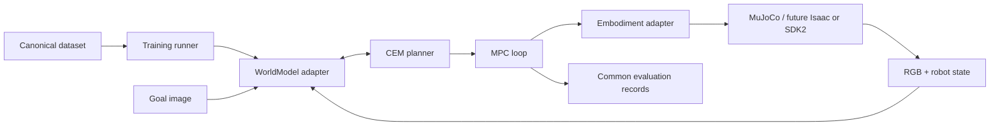

# Architecture and v0 contracts

The executable NumPy-only contracts live in [`src/embodied_jepa/contracts.py`](../src/embodied_jepa/contracts.py). Their validation tests are in [`tests/test_contracts.py`](../tests/test_contracts.py). This freezes data/action semantics, not calibrated physical limits, robot-specific state dimensions, or a working model or simulator implementation.



## Separation and runtime

Models own encoding, latent representation, model-specific preprocessing, prediction, loss, distance, and checkpoints. Planners only sample normalized actions and call model methods. Embodiments own joint ordering, IK/retargeting, calibrated bounds, frames, and transport. Datasets own indexing and canonical samples. Tasks own reset, goals, termination, and outcome measurement. Evaluation owns experiment identity and results.

MuJoCo is the first simulator. Keep its bindings behind a transport adapter, and keep future Isaac and SDK2 imports optional and lazy. Local physics uses CPU; model tensors can use MPS after capability checks, with a recorded CPU fallback. A registry constructs adapters from configuration. No `if backend == ...` logic in the CEM, dataset, task, or evaluator. A backend declares capabilities at load time (supported action schema, history, horizon, device); reject incompatible configurations before execution.

## WorldModel

Retain all PRD methods: `encode(observation, robot_state)`, `predict(z, actions)`, `encode_goal(goal)`, `distance(predicted_z, goal_z)`, `train_step(batch)`, `save(path)`, `load(path)`.

- Observations: mapping of stable camera names to RGB uint8 images; batched shape `[B, H, W, 3]`. Resizing, channel rearrangement, and normalization happen inside the model adapter.
- Robot state: `RobotState` carries float32 `values [B,S]`, boolean `mask [B,S]`, float64 `timestamps [B]`, and a `StateSchema` with ordered field names, units, version, and required flags. `encode(observation, robot_state)` receives the RGB mapping and this structured state; masks must not be discarded. Missing required fields fail validation; missing optional fields remain explicitly masked. Masked values must still be finite placeholders, never treated as measurements. A backend that does not support missing optional fields rejects the input rather than silently treating them as observed zeroes.
- Encoded state: opaque backend-owned `LatentState` with an explicit batch dimension. It may contain visual features, proprioceptive context, and history. The planner cannot inspect latent dimensions.
- `predict`: actions float32 `[B, K, T, A]` for K candidate sequences and T future actions. The adapter handles broadcasting/tiling the encoded state and returns opaque predicted states for all T steps. Goal-image latents need not contain proprioception; `distance` must compare compatible visual features internally.
- `distance`: return finite float32 costs `[B, K, T]`; lower is better. Models own feature-scale normalization. CEM uses final-step goal distance initially; action penalties belong to shared planner configuration.
- `train_step`: consume the same validated `SequenceBatch` for every backend; return named scalar metrics. `SequenceBatch.from_mapping` and `as_mapping` expose the canonical field mapping. Backend owns its optimizer/EMA updates. The runner owns iteration, validation, logging, and checkpoint scheduling.
- Checkpoints include weights, architecture/config, optimizer and scheduler state, normalization, action/state schema versions, dataset hash, seed/RNG state, and source revision. Loading checks schema compatibility.

Never require ground-truth future robot state during inference. A backend with stateful dynamics must predict or internally maintain the required context. Document minimum observation history and populate it from the same sensor stream for both backends. Score only a valid image goal; do not invent a goal joint configuration.

`Capabilities` declares exact action/state schemas, minimum history, maximum rollout horizon, and supported device families. Call `capabilities.require(...)` before running a configuration; matching dimensions alone are insufficient because ordering, units, and masks can differ. Device support describes backend compatibility, not hardware availability; check runtime availability separately. v0 single-frame adapters declare `min_history=1`; adapters needing history must document how they accumulate/reset it before a planner may use them. Runtime-checkable protocols check method presence, not behavioral conformance, so every implementation still needs the shared backend tests.

Example model invocation (backend supplied by the caller):

```python
snapshot = batch.observation(0)  # batch is a validated SequenceBatch
model.capabilities.require(
    action_schema=batch.action_schema,
    state_schema=batch.state_schema,
    horizon=batch.horizon,
)
z = model.encode(snapshot.images, snapshot.state)
predictions = model.predict(z, batch.actions[:, None, :, :])  # K=1
goal = model.encode_goal(batch.observation(batch.horizon).images)
costs = model.distance(predictions, goal)
validate_costs(costs, (batch.batch_size, 1, batch.horizon))
```

The final observation above is a supplied demonstration goal, not a future-state input to `predict`; deployed goals come from the frozen evaluation goal pool.

## Action and embodiment

Frozen `ee_delta_grasp_v0`: `[left_dx, left_dy, left_dz, left_droll, left_dpitch, left_dyaw, right_dx, right_dy, right_dz, right_droll, right_dpitch, right_dyaw, left_grasp, right_grasp]` (A=14). `EE_DELTA_GRASP_V0` is its `ActionSchema`; `ACTION_NAMES` fixes the order. This compresses each hand to one calibrated grasp synergy initially; it does not claim independent dexterous finger control. Keep richer hand controls versioned and optional.

All components are normalized float32 in `[-1, 1]`; validation rejects out-of-range/NaN/Inf values instead of clipping them. Pose deltas map to calibrated meters/radians per control step in the robot-base frame. The base is right-handed: +x forward, +y left, +z up. Rotations are active, extrinsic rotations about fixed base x, then y, then z: `R_next = Rz(dyaw) @ Ry(dpitch) @ Rx(droll) @ R_current`, and `p_next = p_current + [dx,dy,dz]`. This is not addition to an existing Euler-angle vector. Grasp is an absolute synergy target (`-1` open, `+1` closed), not a grasp delta. An all-zero action therefore requests the midpoint grasp target and must never stand in for a safe hold. Scaling, control interval, joint limits, handedness, synergy curves, and saturation are recorded in an action manifest. Simulation scales and limits are now recorded in `configs/g1_sim_action.json` and checked by embodiment tests; physical hardware calibration remains unset and execution disabled.

The `Embodiment` protocol implements all PRD methods: `observe`, `state`, `execute`, `normalize_action`, and `denormalize_action`. `observe()` returns a batched `Observation` (B=1 for one robot) with images, robot state, masks, schema, and common timestamps; `state()` returns the state from that same cached snapshot, not a new independent sensor poll. Sensor timestamp alignment is the adapter's responsibility: reject misalignment before constructing a snapshot. All timestamps are nonnegative float64 seconds from a documented clock domain, shared by observations and execution acknowledgements. Simulation episode-relative time is allowed. `Observation.require_fresh(now, max_age)` rejects stale/future samples using that same clock; never compare episode time with wall-clock time.

`execute()` accepts one `[A]` normalized action. `ExecutionResult` reports the request, actual applied normalized action, status (`applied`, `clipped`, `rejected`, `stopped`), timestamp, and reason. Unchanged application is `applied`; clipping reports the changed action and reason. Rejection/stop carries no applied action and requires a reason; collectors do not fabricate a transition for such a response. Malformed normalized requests fail validation before control. A transport stop is separate from sending an all-zero action.

Joint-space experiments construct a separate `ActionSchema("joint_delta_<embodiment>_v0", ordered_joint_names)`. Components are normalized deltas; calibrated radians/meters per step remain in that schema's embodiment manifest. Its identity and ordered names must match capabilities/checkpoints. It cannot silently share an EE-action checkpoint or infer joint order from array length.

IK/retargeting and control-rate interpolation stay inside the embodiment. MuJoCo is implemented first; future Isaac and physical transport implement the same contract. Assets, simulator stepping, rendering, contact queries, and resets are simulator-specific; model and planner code are not. Workspace, joint, velocity, stale-observation, solver-failure, and stop handling are covered by embodiment checks. MPC executes one action before replanning by default. A missed deadline holds/stops through the adapter according to commissioning policy; it never queues stale actions.

The `Transport` protocol uses `read()` for timestamped raw sensors, `send_joint_targets(targets, joint_names=..., deadline=...)` for ordered physical targets and acknowledgements, `stop(reason)`, and `close()`. MuJoCo/Isaac/SDK2 objects do not escape their transport. The embodiment validates sensor alignment, translates frames/units, checks limits, and maps acknowledgement data back to `ExecutionResult`. Targets have explicit joint ordering, and deadlines use the transport clock. Simulator reset/contact queries belong to simulator/task interfaces; real hardware does not pretend to implement simulator truth or reset semantics. This boundary specifies future ports without importing or claiming to implement Isaac or SDK2.

## Dataset and planner

Transition fields follow PRD §9; `SequenceBatch` is the training representation, including T=1 transitions:

| Field | Shape/type | Meaning |
| --- | --- | --- |
| `observations` | camera-name → uint8 `[B,T+1,H,W,3]` | RGB, separate resolution allowed per camera |
| `robot_states` | float32 `[B,T+1,S]` | Ordered physical state fields defined by `state_schema` |
| `state_mask` | bool `[B,T+1,S]` | True for measured/valid fields; required fields must be valid |
| `actions` | float32 `[B,T,A]` | Actually executed normalized actions, not intended requests |
| `timestamps` | float64 `[B,T+1]` | Strictly increasing aligned observation/state times per item |
| `terminated` | bool `[B,T]` | Transition ends the episode, including collection truncation |
| `episode_ids` | tuple of B nonempty strings | Every item contains a window from exactly one episode |
| `state_schema` / `action_schema` | schema value objects | Versions, exact names/order, units and optionality |

Action `t` applies between snapshot `t` and `t+1`. Interior terminal markers fail validation; a last-step marker may be true or false. A loader must independently check that all rows come from the declared episode/session; the value object cannot recover provenance from pixels. Terminal here is a collection boundary, not a reinforcement-learning bootstrap flag. Arrays must have exact declared dtypes and nonempty axes; inputs are copied into read-only buffers to protect snapshots from reused sensor memory. The constructors do not resize images, normalize states, guess timestamps, or coerce types. `from_mapping` rejects unknown and missing required fields. Dataset normalization statistics come from the training split only.

CEM configuration declares horizon, candidates, elite count, iterations, seed, normalized bounds, and optional shared penalties. Candidate memory is chunked inside the model adapter. Keep evaluation budget and common-mode policy fixed. MPC owns observation, goal encoding, plan, execution, termination, and logging. No model is allowed to select an alternate planner in common mode.
