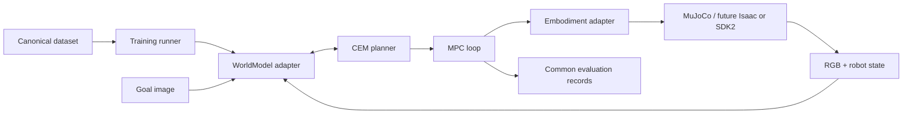

# Architecture and proposed v0 contracts

These are implementation targets for TASK-004, not existing APIs. Resolve dimensions and simulator constraints before freezing v0.

## Separation and runtime

Models own encoding, latent representation, model-specific preprocessing, prediction, loss, distance, and checkpoints. Planners only sample normalized actions and call model methods. Embodiments own joint ordering, IK/retargeting, calibrated bounds, frames, and transport. Datasets own indexing and canonical samples. Tasks own reset, goals, termination, and outcome measurement. Evaluation owns experiment identity and results.

MuJoCo is the first simulator. Keep its bindings behind a transport adapter, and keep future Isaac and SDK2 imports optional and lazy. Local physics uses CPU; model tensors can use MPS after capability checks, with a recorded CPU fallback. A registry constructs adapters from configuration. No `if backend == ...` logic in the CEM, dataset, task, or evaluator. A backend declares capabilities at load time (supported action schema, history, horizon, device); reject incompatible configurations before execution.

## WorldModel

Retain all PRD methods: `encode(observation, robot_state)`, `predict(z, actions)`, `encode_goal(goal)`, `distance(predicted_z, goal_z)`, `train_step(batch)`, `save(path)`, `load(path)`.

- Observations: mapping of stable camera names to RGB uint8 images; batched shape `[B, H, W, 3]`. Resizing, channel rearrangement, and normalization happen inside the model adapter.
- Robot state: named, ordered fields with units, timestamps, and validity masks. Canonical vectors are float32 `[B, S]`; missing optional fields use masks, never silent substitutions.
- Encoded state: opaque backend-owned `LatentState` with an explicit batch dimension. It may contain visual features, proprioceptive context, and history. The planner cannot inspect latent dimensions.
- `predict`: actions float32 `[B, K, T, A]` for K candidate sequences and T future actions. The adapter handles broadcasting/tiling the encoded state and returns opaque predicted states for all T steps. Goal-image latents need not contain proprioception; `distance` must compare compatible visual features internally.
- `distance`: return finite float32 costs `[B, K, T]`; lower is better. Models own feature-scale normalization. CEM uses final-step goal distance initially; action penalties belong to shared planner configuration.
- `train_step`: consume the same transition/sequence mapping for every backend; return named scalar metrics. Backend owns its optimizer/EMA updates. The runner owns iteration, validation, logging, and checkpoint scheduling.
- Checkpoints include weights, architecture/config, optimizer and scheduler state, normalization, action/state schema versions, dataset hash, seed/RNG state, and source revision. Loading checks schema compatibility.

Never require ground-truth future robot state during inference. A backend with stateful dynamics must predict or internally maintain the required context. Document minimum observation history and populate it from the same sensor stream for both backends. Score only a valid image goal; do not invent a goal joint configuration.

## Action and embodiment

Proposed `ee_delta_grasp_v0`: `[left_dx, left_dy, left_dz, left_droll, left_dpitch, left_dyaw, right_dx, right_dy, right_dz, right_droll, right_dpitch, right_dyaw, left_grasp, right_grasp]` (A=14). This compresses each hand to one calibrated grasp synergy initially; it does not claim independent dexterous finger control. Keep richer hand controls versioned and optional.

All components are normalized to `[-1, 1]`. Pose deltas map to calibrated meters/radians per control step in the robot-base frame, using a documented fixed rotation composition order. Grasp maps `-1` to open and `+1` to closed. Scaling, rate, joint limits, handedness, synergy curves, and saturation are recorded in an action manifest. Numerical physical limits remain unset until validated in TASK-008.

The adapter implements all PRD methods: `observe`, `state`, `execute`, `normalize_action`, and `denormalize_action`. An observation and state share a timestamped snapshot; reject stale or misaligned data. Execution reports the applied action, clipping/rejection, and timestamp so collection records what actually ran. Joint-space experimentation uses a separate schema and cannot silently share an EE-action checkpoint.

IK/retargeting and control-rate interpolation stay inside the embodiment. MuJoCo is implemented first; future Isaac and physical transport implement the same contract. Assets, simulator stepping, rendering, contact queries, and resets are simulator-specific; model and planner code are not. Workspace, joint, velocity, stale-observation, solver-failure, and stop handling are covered by embodiment checks. MPC executes one action before replanning by default. A missed deadline holds/stops through the adapter according to commissioning policy; it never queues stale actions.

## Dataset and planner

Transition fields follow PRD §9. Sequences contain T+1 observations/states, T actions, timestamps, episode ID, terminal markers, and validity masks. Never cross episode boundaries. Dataset normalization statistics come from the training split only.

CEM configuration declares horizon, candidates, elite count, iterations, seed, normalized bounds, and optional shared penalties. Candidate memory is chunked inside the model adapter. Keep evaluation budget and common-mode policy fixed. MPC owns observation, goal encoding, plan, execution, termination, and logging. No model is allowed to select an alternate planner in common mode.
